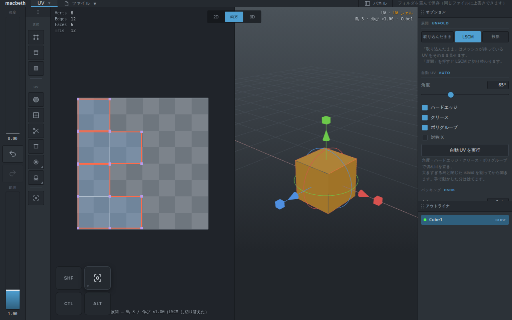
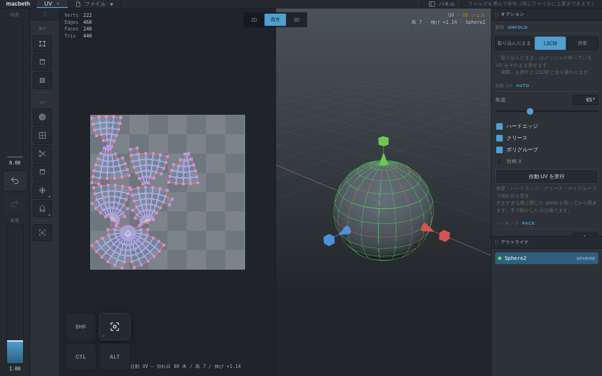
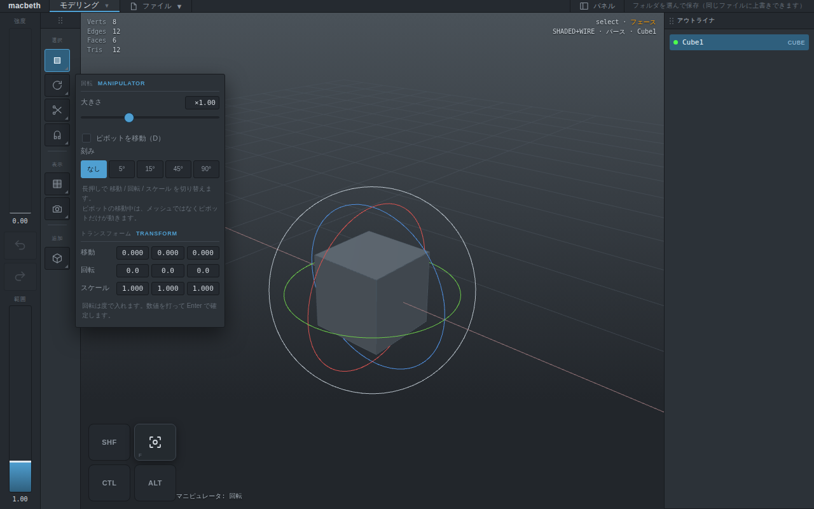
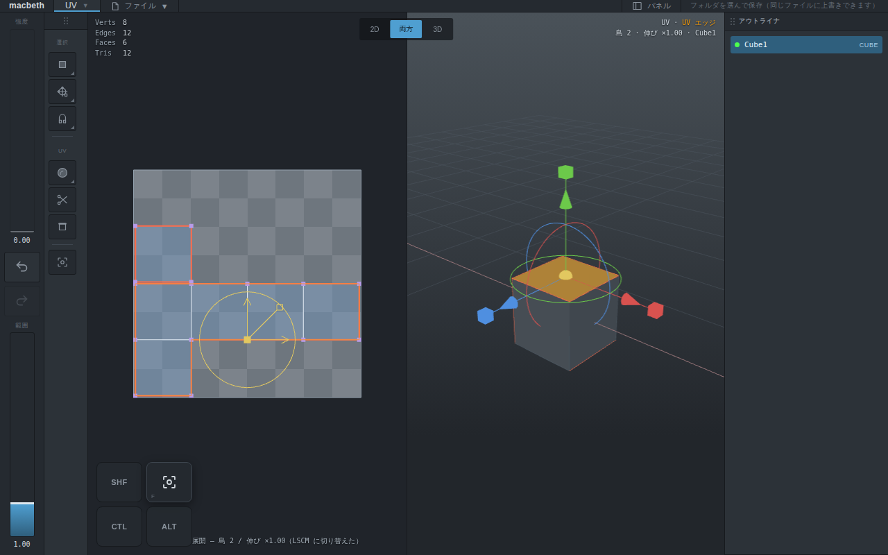

# Opus 作業指示書 #06: UV の修正 3 点、Maya ベースの UV エディタ、パネルの引っ越し

作成: 設計担当（Fable）。実装担当（Opus）向け。2026-09-08。
設計は `19-uv-direction-and-panels.md`（ユーザーが 4 章の 3 点をすべて了承済み）。**迷ったら 19 を読む。この文書は手順だけ。**
前提と作業の流れ（vitest → app → 通し確認 → `publish.sh` → push）は `13` の 0 章のまま。

---

## 0. 順番と理由

> **2026-09-08 改訂（T3 の後）:** T1〜T3 をタブレットで触ったユーザーの指示で、**ツール列をグループにする**設計（`21-tool-groups-design.md`）が入った。`19` の 3.2 を置き換える。T8 を `21` の内容に差し替え、**T8 を T4 より先**にする（ユーザーが今触っているのはツール列で、右のオプションパネルを消すのが描画領域の一番の改善。UV の手順 A〜C はその上で触ってもらう）。

| 順 | タスク | 理由 |
|---|---|---|
| T1 | 履歴に UV レシピを入れる | **済** |
| T2 | 島を立てる（`orient.ts`） | **済** |
| T3 | 余白をテクセルで持つ | **済** |
| **T8** | **ツール列をグループにする（`21`）** | 右のオプションパネルが消える。以後の確認はこのツール列で行う |
| T4 | 手順 A: 立方体を切って開いて整える | ここから「Maya ベースで作りきる」。1 タスク = 1 手順 |
| T5 | 手順 B: 円柱（ループ / リング選択、境界の直線化） | A の上に乗る |
| T6 | 手順 C: 球（対称、格子化、Move and Sew） | B の上に乗る |
| T7 | 自動 UV と方式切替を「展開」の長押しの奥へ | T4〜T6 で入口が Maya の形になってから |
| T9 | アウトライナ → レイヤーのドロワー | T8 で右上が空いているので最後 |

**T8 が終わったら一度 push して報告する**（ユーザーがツール列を触る）。その後 T4〜T7、T9 を続け、**T9 が終わったら報告して止まる**。

各タスクの合格条件は「値」と「触って分かること」の両方。後者は通し確認に書く（`13` の「通し確認の書き方」）。**タスクごとに `scripts/smoke.mjs` の項目を足し、報告に画面の PNG を付ける**（`smoke.png` と同じ撮り方で、`docs/img/20-<task>.png` に置く）。

---

## T1. 履歴に UV レシピを入れる（`19` の 1.3）

### app

- `history.ts`
  - `ObjectSnapshot` に `uv: UvRecipe | null` を足す。`snapshot()` で `o.uv ? cloneRecipe(o.uv) : null`、`restore()` で `o.uv = s.uv ? cloneRecipe(s.uv) : null`。**`cloneRecipe` は `base` の Float32Array も複製している**（`recipe.ts` の 74 行）ので、そのまま使ってよい
  - `import { cloneRecipe } from "../core/uv/recipe.js"` は `core/index.js` から出ていなければ index に足す
- `app.ts` の `afterHistory()`
  - `this.state.mode === "uv" && this.uv` なら、`viewport.syncAll()` の後に `this.uv.rebuild()` → `this.pushSelectionToUv()` → `this.hud.uvNote = this.uv.stats()`
  - 選んでいたオブジェクトが戻したことで消えていたら（`state.selected` が null）、2D は空にする（`rebuild()` が object null で空を描くことを確認する。描かないなら直す）
- `uvMode.ts` は変えない。2D の操作はすべて `host.commit` を通っている

### 通し確認（1 項目）

「2D で戻す / 進むが効く」: UV モードで立方体の島を 1 つ動かす → 2 本指ダブルタップ（`tapUp` の経路。`smoke` の「3 本指ダブルタップは変形にならず、やり直しになる」と同じ発火のしかた）→ `map1` が元に戻り、2D の島の位置も戻る → 3 本指ダブルタップ → 動かした位置に戻る。さらに **カット → 2 本指ダブルタップ → 切れ目の数が戻る**（レシピが戻ることの確認。メッシュだけ戻っていると切れ目は残る）。

### vitest（1 件）

`tests/uv.test.ts` に U16: `cloneRecipe` の往復で `seams` / `pins` / `base` / `manual` / `packing` が等しく、複製の `base` を書き換えても元が変わらない。

## T2. 島を立てる（`19` の 1.1）

### core

`src/core/uv/orient.ts`:

```ts
/**
 * 島を「3D の上」が +V を向くように回す。LSCM は形しか決めないので向きはここで決める。
 * 上向きが面にほぼ乗らない島（天面・底面）は、3D の X を +U に向ける。
 */
export function uprightChart(positions: Float64Array, tri: Uint32Array, uv: Float64Array): void;
```

やること:

1. 三角形ごとに、3D の (0,1,0) を面に落としたベクトル `t3` を取る（`t3 = up − n (n·up)`、`n` は面の単位法線）。長さが 0.2 未満なら「上が乗らない」として X 軸で同じことをする。**島の中で多数決**（面積の重み付き）で、上 / X のどちらを使うかを島ごとに 1 つ決める
2. `t3` を UV に写す。`distortion.ts` の `measure` と同じヤコビアン（3D の 2 辺 → UV の 2 辺）を使い、`t2 = J · (t3 を三角形の局所座標に直したもの)`。関数が `measure` の中に閉じているなら、ヤコビアンを返す小さな関数を `distortion.ts` から export して共有する（複製しない）
3. `t2` を三角形の UV 面積で重み付けして足し、角度 `θ = atan2(sum.u, sum.v)` を取る（+V に向けたいので U と V の順に注意）
4. 島の UV 重心を中心に `−θ` 回す（`uv` をその場で書き換える）
5. 回した結果、島が裏返っている（UV の符号付き面積が負）なら **U を反転しない**。裏返りは LSCM の固定点の問題で、ここでは扱わない（`19` の外）

`recipe.ts` の `recompute`: `method !== "none"` のとき、`isUsable` / `normalizeScale` の後、`measure` の前に `uprightChart(local.positions, local.tri, flat)`。`"none"` には掛けない（取り込んだ向きを保つ）。

### vitest（`tests/uv.test.ts` に U17〜U19）

- U17 立方体を 12 本すべて切って LSCM → 6 島それぞれで、すべての辺が U 軸か V 軸に平行（角度の誤差 1e-4 rad）
- U18 円柱（`sdAxis: 12, sdHeight: 3`）の側面を縦 1 本で切って LSCM → 側面の島の「縦の辺」（3D で Y 方向の辺）が V に平行、かつ上のリングの V が下のリングより大きい（上下が逆になっていない）
- U19 天面（法線 +Y）の四角 1 枚だけ → X の辺が +U を向く（`uv[b] − uv[a]` の U 成分が正）

### 通し確認（1 項目）

「展開した島がまっすぐ」: 立方体 → UV モード → シェルを全部選んで「展開」→ `map1` から 6 島の辺の向きを測り、全部が軸に平行。**PNG を付ける**。

## T3. 余白をテクセルで持つ（`19` の 1.2）

### core

- `recipe.ts` の `packing` を `{ marginTexels: number; textureSize: number; allowRotate: boolean; texelDensity: number | null }` に。既定 `{ marginTexels: 8, textureSize: 1024, allowRotate: false, texelDensity: null }`
- 余白（UV）を出す関数を `pack.ts` に: `marginUv(packing) = max(marginTexels, ceil(5 × 1024 / textureSize)) / textureSize`。`packCharts` と `shelfPack` はこれを受け取る（`shelfPack` の引数は今のまま `margin: number`）
- `shelfPack` の外周: 今も `margin` を両端に残している。そのまま（合っている）。**ただし棚の高さの計算で `cursorY += shelfHeight + margin` と `usedHeight` の整合を確認する**。上端の余白が下端より小さくなっていたら直す
- `deserializeRecipe`: `json.packing.margin` が数値で `marginTexels` が無ければ `marginTexels = Math.round(margin × 1024)`、`textureSize = 1024`。`allowRotate` は **保存物に無ければ false**（今の既定 true を引き継がない）
- `serializeRecipe` は新しい形で書く

### app

- `panels.ts` の UV 区画に「パッキング」を足す: 余白（texels、2〜64、刻み 1）、テクスチャの大きさ（512 / 1024 / 2048 / 4096 の segmented）、90° 回転を許す（checkbox）。`PanelHost` に `onUvPackingChange(key, value)` を足し、`app.ts` で `recipe.packing[key] = value` → `uv.repack()`。**T8 でこの区画はカットインへ移る**ので、区画を関数 1 つ（`packingSection(parent, state, host)`）に分けておく
- `uvMode.ts` の `repack()` は変えない

### vitest（U20〜U21）

- U20 球の自動 UV → 全島の境界箱どうしの最短距離が `marginUv` 以上、外周（0 と 1）からも同じだけ離れている。`textureSize: 512` にすると余白が 10/512 になる
- U21 `deserializeRecipe({ packing: { margin: 1/128, allowRotate: true } })` → `marginTexels === 8`、`allowRotate === true`（明示は尊重）。`packing` に `allowRotate` が無ければ false

### 通し確認（1 項目）

「島は 5px 以上離れる」: 球 → 自動 UV → `map1` の島の境界箱の距離が 8/1024 以上。**ここまでで push して報告する。**

---

## T4. 手順 A: 立方体を切って開いて整える（`19` の 2.2 の 1〜2）

Maya の UV エディタで立方体をやる手順そのものを、上から順に通す。**足りないものはこの手順の途中で見つかった順に埋める**。

手順（通し確認もこの順）:

1. 立方体を選び UV モードへ。**取り込んだ UV（十字の展開図、島 1）が 2D に見える**（済）
2. 3D で上の面を選ぶ → 2D でその面が光る（済）
3. マーキングメニュー「カット」→ 上の面が島として分かれる（済）
4. 「展開」→ 2 島とも立っている（T2）、間が空いている（T3）
5. UV エッジの単位で島の縁を 1 本タップ → **Shift + ダブルタップで縁を一周**（新: UV のループ選択）
6. 「直線化」→ その縁が直線になる（済。`straightenPoints`）
7. 島をマニピュレータで動かす → 2 本指ダブルタップで戻る（T1）
8. 3D に戻り、3D で面を 1 枚選ぶ → 2D で島が選ばれる（済）→ 2D で島をダブルタップ → **島全体が選ばれる**（新: シェルのダブルタップ）
9. 「整列」→ 2 島が 0〜1 に詰まる（済）

新しく作るもの:

- **UV のループ選択**（`uvMode.ts`）。2D の `down` にダブルタップの判定を足す（`select.ts` の `double` と同じ: 前回のタップから 400ms 以内、同じ点から 12px 以内）。単位ごとに:
  - エッジ: `core/uv/loops.ts` に `uvEdgeLoopFrom(t: UvTopology, e: number): number[]` を足す。UV 頂点の次数と「向かい側の辺」で辿る `selection.ts` の `edgeLoopFrom` と同じ規則を、**UV トポロジ（島の中だけ、縁で止まる）** で行う。縁の辺なら縁を一周する。Shift + ダブルタップで前回の辺と同じループ上なら区間（`arcBetween` と同じ）
  - 頂点: 前回の頂点との間の UV 頂点列（3D の「頂点列」と同じ）。Shift 無しなら島の全頂点
  - シェル: 島全体（今のシェル単位はタップで島なので、ダブルタップは何もしない。**頂点 / エッジの単位でダブルタップしたら島全体の頂点 / エッジを選ぶ**）
  - `UvTopology` は `uvView.ts` にあり DOM に依存しない型なので、`core/uv/loops.ts` は **型だけ** `import type` で受ける。core が app を import するのは違反なので、`UvTopology` の必要な部分（`edges`, `vertexCorners`, `edgeChart`）を `core/uv/charts.ts` へ移し、`uvView.ts` はそれを re-export する
- **選択の伝播**（`app.ts` の `pushSelectionToUv`）: 3D で面 → 2D で島（済）。**3D でエッジ → 2D で同じ UV エッジ、3D で頂点 → 2D で同じ UV 頂点**（`syncFromView` が単位を受けるようになっているので、抜けている単位があれば埋める）

### vitest（U22〜U23）

- U22 `uvEdgeLoopFrom`: 立方体の十字（島 1）で縁の 1 本から一周 → 14 本。内側の辺から → 縁で止まる
- U23 `uvEdgeLoopFrom`: 円柱の側面（縦 1 本で切った島）で横の辺 → 12 本（一周）

### 通し確認（1 項目、上の 1〜9 をそのまま）

「立方体: 切って開いて整える（手順 A）」。**PNG を付ける。**

## T5. 手順 B: 円柱（ループ / リングと境界の直線化）

手順:

1. 円柱を追加 → UV モード → 取り込んだ UV（側面の帯 + 上下の円）が見える（済）
2. 3D でエッジ単位、側面の縦の辺 1 本をタップ → **ダブルタップでエッジループ**（3D は済）→ 2D にも同じ辺が出る（T4）
3. 「カット」→ 側面が縦に切れる（済。エッジ単位のカット）
4. 「展開」→ 帯が横長で立っている（T2）
5. UV エッジ単位で帯の上の縁 1 本 → Shift + ダブルタップで反対側 → 上の縁の区間（T4）→ **「境界の直線化」**（新）で縁が水平に
6. 下の縁も同じ → **「格子化」**（新。Maya の Unfold の「Straighten UVs」ではなく **UV の格子化 / Gridding**）で帯全体が長方形の格子になる
7. 「整列」→ 3 島が詰まる

新しく作るもの（`uvMode.ts` の `tidy` に 2 種類足す。core は `ops.ts` にある）:

- `straightenBorder`（済の関数）を **「境界の直線化」** として編集メニューのエッジ単位に。選んだ辺が島の縁を成していれば `borderLoop` の順に並べて渡す。縁でなければ toast「縁の辺を選んでください」
- `gridding`（済の関数）を **「格子化」** として編集メニューのシェル単位に。島が「四角形だけで、縁が 4 本の直線に分けられる」ときだけ効く。行の並びは `uvTopology` の辺から取る（横方向のループを 1 本ずつ辿る。T4 の `uvEdgeLoopFrom` を使う）。条件を満たさなければ toast

編集メニューの割り当て（`app.ts` の `uvEditMenu`。北 / 北東 / 東は固定のまま）:

| 単位 | SE | S | SW | W | NW |
|---|---|---|---|---|---|
| エッジ | 整列（Layout） | 直線化 | **境界の直線化** | 整列 U / V（サブメニュー化しない。W = 整列 V、SW から「整列 U」を外す） | マージ |
| シェル | 自動 UV → **T7 で外す** | 整列 | **格子化** | 反転 U | 反転 V |

整列 U をどこに置くか: エッジ単位の「直線化」は選んだ点が縦か横かを自分で判断するので、**整列 U / V は頂点単位に残し、エッジ単位からは外す**。

### vitest（U24〜U25）

- U24 `gridding` を円柱の側面（縦 1 本で切った島）に当てる → すべての UV 頂点が「行の V が等しく、列の U が等しい」格子（1e-6）
- U25 `straightenBorder` で帯の上の縁を渡す → 縁の V が全部同じ

### 通し確認（1 項目、上の 1〜7）

「円柱: ループで切って開いて格子にする（手順 B）」。**PNG を付ける。**

## T6. 手順 C: 球（対称、Move and Sew）

手順:

1. 球を追加 → UV モード → 取り込んだ UV（緯度経度の 1 枚）
2. 3D で経線 1 本をダブルタップ（エッジループ）→ カット → 展開 → 1 島が開く（極は閉じているので歪みが大きい）
3. 赤道のループを選んでカット → 上下 2 島
4. 上の島を選び、**Shift で下の島も選び「Move and Sew」**（新）→ 下の島が上の島の切れ目に合うように動いて縫われる（Maya の Move and Sew UV Edges）
5. UV 頂点単位で島の左右を矩形で選び「対称」→ 左右がそろう（済）
6. 「整列」

新しく作るもの:

- **Move and Sew**（`uvMode.ts` に `moveAndSew()`）。選んだ UV エッジ（またはシェル 2 つの間の切れ目）について、**小さいほうの島**を相似変換（移動 + 回転 + 一様スケール）で、切れ目の両端が相手側の両端に重なる位置へ動かし、そのあと `cutOrSew(false)` と同じ経路で縫う。動かした分は差分として `manual` に入れ（`recordFrom`）、縫った後の `recompute` で島が 1 つになる。**相似変換の 4 パラメータは 2 点対応から閉じた形で出る**（Procrustes、2 点なら一意）。`core/uv/ops.ts` に `similarityFrom2(a0, a1, b0, b1): {du, dv, angle, scale}` を足す
- 編集メニュー: エッジ単位の東「ソー」を長押し… ではなく、**エッジ単位の「ソー」を Move and Sew に変える**。Maya でも通常使うのはこちらで、動かさずに縫う「Sew」は結果が同じ（recompute で島が繋がる）。シェル単位の「ソー」も同じ。頂点単位は今のまま

### vitest（U26）

- U26 `similarityFrom2`: (0,0)-(1,0) を (2,2)-(2,4) に写す → scale 2、angle 90°、写した点が 1e-9 で一致

### 通し確認（1 項目、上の 1〜6）

「球: 切って開いて Move and Sew で戻す（手順 C）」。**PNG を付ける。**

## T7. 自動 UV と方式切替をオプションの奥へ（`19` の 2.2 の 3）

- ツール列（`uvToolColumn`）: 「自動 UV」のボタンを外す。並びは **選択 3 / 展開 / カット / ソー（Move and Sew）/ マニピュレータ / スナップ / フレーム**
- シェル単位の編集メニュー SE「自動 UV」を外し、そこに **「格子化」** を置く（T5 の表を更新）。SW / W は反転 U / V のまま
- 「展開」ボタンの**長押し**で展開のオプションがカットイン（`21` の 3 章）: パッキング（T3 の `packingSection`）、方式 segmented（取り込んだまま / LSCM / 投影）、自動 UV（角度・ハードエッジ・…・「自動 UV を実行」）。方式と自動 UV は**折りたたみにして既定は閉じる**（`section` に `open?: boolean` を足し、`<details>` で描く）。見出しは「詳細（自動 UV・方式）」
- 「展開」ボタンの挙動は今のまま（`none` → `lscm`）
- 通し確認: 既存の「自動 UV で球が開ける島に分かれる」は `uv.autoUnwrap()` を直接呼んでいるはずなので、そのまま通る。ボタンが無くなったことだけ足す（ツール列に `title` が「自動 UV」のボタンが無い）

---

## T8. ツール列をグループにする（`21`）

設計は `21-tool-groups-design.md`。**迷ったら 21 を読む。** ここは手順だけ。

### 順（この中も上から）

1. **骨格**: `app.ts` の `toolColumn()` を `ToolGroup[]`（`21` の 3 章）に置き換える。`renderToolColumn` は `icon()` を毎回呼ぶ。`openToolOptions(anchor, group)` を `openManipSizeGauge` から起こす（`.cutin.wide`、236px、`max-height: 70vh; overflow: auto`）
2. **区画の分割**: `panels.ts` の `renderOptions` を区画ごとの関数に分けて export（`packingSection` と同じ形）。`renderOptions` は消す。右の「オプション」パネル（`zones.options`、`optionsBody`、`buildPanels` の前半）を消す。**右上ゾーンの DOM は残す**
3. **変形グループ**: `manipMenu` + ピボット編集 / リセット。カットインに縦ゲージ（`openManipSizeGauge` の中身を移す）、ピボット編集トグル、回転の刻み（`state.rotateStep`）、負のスケール防止（`state.preventNegativeScale`。`transform.ts` のスケールのドラッグで 0 を跨がせない）
4. **選択グループ**: `COMP_MODES` を長押しに。カットインにカメラベース選択（`state.cameraBased`。`picking.ts` の `pickVertex` / `pickEdge` と `select.ts` の矩形に遮蔽の判定。`21` の 2.1）、ソフト選択、頂点 / 押し出し / ミラーの区画
5. **編集グループ**: マルチカット / ベベル / ブリッジ / 押し出し / コネクト / ウェルド。`state.lastEdit`。既存の `doBridge` などをそのまま呼ぶ
6. **追加グループ**: `PRIMITIVE_ORDER` を 8 方位に。`state.lastPrimitive`、`state.primitiveDefaults`。カットインは「選択がパラメトリックならその入力ノード、そうでなければ次の既定値」
7. **カメラ / 表示 / スナップ**: `cameraMenu()` を長押しに、`openCameraPopup` の中身をカットインへ。`shadingMenu` を長押しに。スナップは今のまま + 長押しメニューに「オプション…」
8. **UV モードのツール列**: 「選択」を 1 グループに、マニピュレータとスナップは共通。展開の長押しは T7 で

### state

`cameraBased = false`、`rotateStep = 0`、`preventNegativeScale = true`、`lastEdit = "multicut"`、`lastPrimitive = "cube"`、`primitiveDefaults: Record<string, PrimitiveParams>`（`defaultParams` から初期化）。`localStorage` に残すのは `cameraBased` / `rotateStep` / `preventNegativeScale` / `lastPrimitive`。

### 通し確認（7 項目。`21` の 4 章をそのまま）

1. ツール列のボタンが 7 つ、右のオプションパネルが無い
2. 変形を長押し → 回転 → アイコンが回転 → タップ → 刻み 15° → ドラッグで 15° ずつ
3. マルチカット中に変形をタップ → 移動に戻ってオプションが出る
4. 追加を長押し → 球 → アイコンが球 → タップ → 「Sphere1 の入力」→ 選択を外してタップ → 「次の球」
5. カメラを長押し → 上ビュー → タップ → 焦点距離
6. 選択をタップ → カメラベース選択オン → 立方体の矩形選択で手前の 4 点だけ
7. スケールで 0 を跨がない（オプションを切ると跨ぐ）

既存の「アウトライナとオプションが出る」は「アウトライナが出る」に変える（スライダーの条件を外す）。「マニピュレータ: タップで大きさのゲージ、ピボットの移動」は「変形をタップ → カットインの中のゲージ」に書き換える。「パネルを別の場所へドッキングできる」はアウトライナで行う。

**カメラベース選択の時間**を報告に書く（球 `sdAxis: 64, sdHeight: 64` の矩形選択で何 ms か。1 秒を超えるなら深度バッファに切り替える。`21` の 2.1）。

**ここで push して報告する。** PNG は `docs/img/20-t8-toolgroups.png`（ツール列 + 変形のカットインが出ている画面）。

## T9. アウトライナ → レイヤーのドロワー（`19` の 3.3）

### 決め

| 項目 | 決め |
|---|---|
| 出し方 | 上段右端の「レイヤー」ボタン（`btnPanels` を転用。ラベルを「レイヤー」に、アイコンは `ICONS.layers` を足す）。もう一度で閉じる。**右端から左へのスワイプでも出る**（`vp` の右端 24px から始まるタッチの横スワイプ。ペンは対象外） |
| 見た目 | 右から被さるドロワー `.drawer`。幅 236px、`position:absolute; right:0; top:0; bottom:0; z-index:25`。`vp` は縮まない。出入りは `transform: translateX` の 0.16s |
| 1 行 | サムネイル 40×40（そのオブジェクトだけを描いた画像）、名前、目（表示）、ロック |
| 操作 | タップで選択、ダブルタップで改名（済）、長押しでメニュー（改名 / 複製 / 削除 / 結合 / 分離 / フレーム。**結合と分離は既存の `doCombine` / `doSeparate` を呼ぶ**）、**行の長押し後ドラッグで並び替え**（`doc.objects` の順を入れ替え、履歴に積む）、SHF + タップで複数選択（結合のため。`state.multi` のような選択集合が無ければ、ドロワーの中だけの `checked` 集合で持ち、結合のときにまとめて渡す） |
| 行を開く | 行の右端の「>」で、その行の下にプロパティが展開: トランスフォームの数値入力、表示 / ロック、メッシュの情報（頂点・面の数）。**プリミティブのパラメータは「追加」グループのカットイン**（`21` の 2.7）に置くので、ここには出さない |
| 閉じるとき | 外を触る（`vp` の `pointerdown` を捕まえて閉じる。ドロワーの中は閉じない）、ボタン、右へスワイプ |
| PC | 幅 1200px 以上なら **ドロワーではなく今のドッキングのまま**（右上ゾーンに「レイヤー」パネルとして置く。中身は同じ `renderLayers`）。判定は `layout.ts` に `get isWide(): boolean`（`stage` の幅 ≥ 1200）を足し、`apply()` で変わったら `onChange` |

### app

- `panels.ts`: `renderOutliner` → `renderLayers(body, objects, selected, host, opened: Set<string>)`。行は `.lyrow`（`.olrow` の CSS を継ぐ）。`PanelHost` に `onVisible(o, v)`, `onLock(o, v)`, `onReorder(from, to)`, `onCombineChecked(ids)`。**ロックは `SceneObject.locked: boolean` を core に足す**（選択と変形を受け付けない。`.mbz` に保存。`Document` のテストに 1 件）
- サムネイル: `viewport.ts` に `thumbnail(o, 40): string`（data URL）。**そのオブジェクトだけ**を描いた小さなオフスクリーン描画。開いたときに全行ぶん描き、`refresh()` では描き直さない（`19` の 3.4）
- `app.ts`: `buildPanels()` からオプションを消し、アウトライナを **`isWide` ならドッキング、そうでなければドロワー**に置く。`btnPanels` の `click` を「ドロワーの開閉（狭い）/ ドック列の表示切替（広い）」に
- 右端スワイプ: `gestures.ts` は触らない。`vp` に `pointerdown` を 1 つ足し、`clientX > vp.right − 24 && pointerType === "touch"` のときだけ `pointermove` で 40px 左に動いたら開く（動かなければ何もしないので、既存の操作を邪魔しない）
- `shell.css`: `.drawer`、`.drawer.open`、`.lyrow`、`.lyrow .thumb`、`.lyrow .eye`、`.lyrow .lock`、`.lyrow .more`、`.lyprops`

### vitest（1 件）

`tests/document.test.ts`（無ければ作る）: `locked` が `.mbz` の往復で残る。

### 通し確認（2 項目）

- 「レイヤーのドロワーが開いて、目で隠せる」: 狭い画面（1024×768）で「レイヤー」ボタン → `.drawer.open` → 行が 2（立方体と球）→ 目をタップ → `o.visible === false` → 外をタップで閉じる
- 「広い画面ではレイヤーがドッキングされる」: 1400×900 で `.panel[data-panel="layers"]` が右上ゾーンにあり、ドロワーは無い

既存の「縦持ちで右のドックが下に来る」は、狭い画面ではドック列が空になるので **「縦持ちでレイヤーのドロワーが右から出る」に書き換える**。「パネルを別の場所へドッキングできる」は広い画面で行う（1400×900 に切り替えてから）。

---

## 決めてあること（追加分）

- 島を立てる基準は 3D のワールド Y。オブジェクトの回転は見ない（メッシュはローカル座標）
- 余白の最低 5px は 1024 換算ではなく **そのテクスチャの大きさで 5px**（`19` の式）
- T4〜T6 の「手順」は通し確認そのもの。**値の合格条件だけで済ませない**
- Move and Sew は小さいほうの島を動かす。同じ大きさなら番号の大きいほう
- ロックされたオブジェクトはピックの対象から外す（`picking.ts` で `locked` を除外）
- ドロワーは `vp` の上に乗る。描画領域の大きさは変えない（`viewport.resize()` を呼ばない）

## やらないこと

- ヒートマップ、ABF++ / SLIM、切れ目の提案（C4）
- グループ / 階層（レイヤーのフォルダ）
- サムネイルの逐次更新
- 3D のマルチ選択（複数オブジェクトの同時変形）。ドロワーの複数選択は結合のためだけ
- `gestures.ts` のしきい値と判定を変えること

## 報告

T3 のあとと T9 のあとの 2 回。各回で: 変えたファイル、core の件数、通し確認の件数、**PNG**（`docs/img/20-*.png`）、設計と変えたところ、判断が要った点。

---

## 実装の報告 その 1（Opus、2026-09-08。T1〜T3）

修正 3 点が入った。**core 181 件、通し確認 55 項目、すべて緑。**

| | やったこと | 変えたファイル |
|---|---|---|
| T1 | 履歴のスナップショットに `uv` レシピを足し、戻したあと 2D を作り直す | `app/history.ts`、`app/app.ts` |
| T2 | 解いたあと島ごとに回して立てる | `core/uv/orient.ts`（新）、`core/uv/distortion.ts`、`core/uv/recipe.ts` |
| T3 | 余白をテクセルで持ち、棚詰めの隙間が縮まないようにする | `core/uv/pack.ts`、`core/uv/recipe.ts`、`app/ui/panels.ts`、`app/app.ts` |





### 設計と変えたところ

- **`shelfPack` を作り直した（指示書に無い）。** 余白をテクセルにしても隙間は空かなかった。原因は指示書の想定とは別のところで、**棚詰めが「島も隙間も一緒に並べてから、全体を 0〜1 に縮めていた」**こと。縮める倍率 `scale` が隙間にも掛かるので、島が増えるほど（＝ `scale` が小さいほど）隙間が詰まる。球の自動 UV（島 7）では `scale ≈ 0.3` で、8/1024 のつもりの隙間が 2.4px になっていた。ユーザーの「島が隣接する」はこれ。
  直し方は「先に島を縮めてから、最終の長さで隙間を入れる」。ただし縮める倍率が閉じた形で出なくなるので、**収まる最大の倍率を二分探索**する（40 回固定なので決定的。U3 は通る）。U20 に「同じ島 40 枚でも隙間が縮まない」を足した（前の実装だとここで潰れる）
- **人がピンで向きを決めている島は立てない。** レシピのピンが 2 点以上あるとき、`normalizeScale` はすでに掛からない決めになっていた（大きさは人が決めたもの）。向きも同じはずなので `uprightChart` も外した。自動ピンで解いた島だけ立てる
- **ヤコビアンは `distortion.ts` から `triangleFrame` として出した。** `measure` の中に閉じていたので指示書どおり切り出し、`measure` 自身もそれを使うようにした（複製しない）。面内の基底 `ex` / `ey` と法線・面積・UV 面積も一緒に返す
- **`margin` の削除。** 古い `.mbz` を読んだとき、`{ ...recipe.packing, ...json.packing }` で古い `margin` が残ってしまうので、移行のあとに消している
- パッキングの区画は `packingSection(state, host)` として `panels.ts` から export した（T8 でカットインへ移す）

### 判断が要った点

- **余白の式。** `19` の 1.2 は「UV の余白 = marginTexels / textureSize」と「最低 5px の規則 = `max(marginTexels, ceil(5 × 1024 / textureSize))`」の両方を書いている。後者は 1024 を基準にテクセル数を引き上げる形なので、512 では 10 テクセル = **10px** になる（5px でよければ 5 テクセルで足りる）。U20 の期待値（`10/512`）がこの形だったので、指示書どおりに実装した。既定（1024 で 8 テクセル）は 8/1024 で、これは前の `margin: 1/128` と同じ値なので見た目は変わらない
- **`allowRotate` の既定を false にすると、詰まり方は悪くなる。** 立方体を 1 面おきに切った例では、島 2 枚が縦に積まれて右半分が空く（0〜1 の 52%）。90° 回せば埋まるが、T2 で立てた向きが崩れる。向きを優先した（`19` の 1.2 の決めどおり）。詰まり方は T5 の「整列」で人が直せる
- **`afterHistory` の 2D 作り直しは `pushSelectionToUv` まで呼ぶ。** 選択も履歴に入っているので、戻したあとの選択で 2D を塗り直さないと 3D と食い違う
- 報告用の画面を撮る `scripts/shot.mjs` を足した（`npm run shot <名前>`）。`smoke.mjs` と同じ配信のしかたで、場面を 1 つ動かして `docs/img/` に置く

### 通し確認に足した項目（3 つ）

- 2D で戻す / 進むが効く（切れ目も戻る） — 指 2 本ダブルタップで UV が戻り、3 本で進む。カットも戻る
- 展開した島がまっすぐ（軸に平行） — 立方体を切って開き、面の辺がすべて U 軸か V 軸に沿う
- 島どうしが 5px 以上離れる — 球の自動 UV で 1024 なら 8px、512 に落とすと 10px

### 次

~~T4（手順 A: 立方体を切って開いて整える）から。~~ → ユーザーの指示でツール列の設計（`21`）が入ったので、**T8 から**。T8 の後で T4〜T7、T9。

---

## 実装の報告 その 2（Opus、2026-09-08。T8）

ツール列を 7 つのグループにした。**core 181 件、通し確認 67 項目、すべて緑。**



| グループ | 長押し | タップ |
|---|---|---|
| 選択 | オブジェクト / 頂点 / エッジ / フェース + 拡張（CTL で縮小） | 選択ツールに戻り、カメラベース選択・ソフト選択・頂点 / ミラー |
| 変形 | ユニバーサル / 移動 / 回転 / スケール + ピボットの移動 / 戻す / 初期設定 | 大きさ・ピボット・回転の刻み・負のスケール防止・トランスフォーム数値 |
| 編集 | マルチカット / ベベル / ブリッジ / 押し出し / 接続 / ウェルド | 最後に使ったもののオプション（ツールなら有効化も） |
| スナップ | 種類 + **オプション…** + オフ | オン / オフ（意味は変えない） |
| 表示 | ワイヤ / シェード / + ワイヤ / スムース / チェッカー | スムージング角度 |
| カメラ | `cameraMenu()` そのもの + 控えたカメラの一覧 | 焦点距離 / ニア / ファー / 平行投影 |
| 追加 | プリミティブ 8 種（北から時計回り） | 選択がパラメトリックならその入力ノード、無ければ「次の◯◯」の既定値 |

右の「オプション」パネルは無くなり、アウトライナが右上に移った。UV モードも同じ規則（選択 / 変形 / スナップはグループ、展開 / カット / ソー / フレームはコマンド。展開は**タップで実行、長押しにオプション**）。

### 設計と変えたところ

- **カメラベース選択は「遮蔽」ではなく「面の向き」で判定した（`21` の 2.1 と違う）。** 指示どおり最初はレイキャストで作り、通し確認で測ったところ **頂点 3010 点の球で 964ms** かかった。4 万点なら 13 秒で、矩形選択には使えない。
  Maya の Camera based selection は「カメラを向いている面のコンポーネントだけ」で、他のオブジェクトによる遮蔽は見ない仕様なので、そちらに合わせた。面ごとに法線とカメラの向きを 1 回だけ比べる O(面 + 頂点) で、**同じ球で 9ms**（100 倍速い）。立方体を前から見て 8 点 → 4 点になることは通し確認で見ている。
  真横を向いた面（内積がほぼ 0）は表に数えない。丸め誤差で `cos = 1e-17 > 0` になり、前ビューで裏の頂点まで拾ってしまうため
- **`attachRadialButton` の window 購読を、押している間だけにした。** ツール列はアイコンが変わるたびに描き直すので、ボタンより長生きする購読が積み上がっていた（前からあった漏れ。今回の変更で描き直しの回数が増えるので直した）
- **タップの入口はボタンを探し直してから開く。** `onTap` がツール列を描き直すことがあり、そのまま元のボタンを掴んでいるとカットインの位置が (0,0) になる。`data-group` で引き直している
- **「編集」のコマンドはタップでは実行しない**（`21` の 2.3 どおり）。長押しのメニューから選んだときだけ実行し、タップはオプションを出すだけ。ターゲットウェルドはドラッグの挙動なので、オプションは頂点の区画（マージ距離・押し出しの太さ）を出している
- `renderOptions` は消し、区画ごとの関数に分けて export した（`transformSection` / `manipulatorSection` / `selectSection` / `multicutSection` / `bevelSection` / `extrudeSection` / `bridgeSection` / `connectSection` / `snapSection` / `mirrorSection` / `vertexSection` / `softSelectSection` / `primitiveSection` / `displaySection` / `cameraSection` / `uvUnfoldSection` / `uvSnapSection` / `packingSection`）
- `openCameraPopup` と `openManipSizeGauge` と `cycleDisplay` と `manipMenu` は、中身をカットインと長押しへ移したので消した

### 判断が要った点

- **「変形」の押された表示はピボット編集中だけにした。** 「選択」と「変形」はどちらも選択ツールなので、両方を `tool === "select"` で押されて見せると区別がつかない。選択 = ツールが select、変形 = ピボット編集中、編集 = マルチカット / ベベル中、とした
- **負のスケールの下限を 0.02 → 0.001 にした。** 前から `Math.max(0.02, …)` で裏返りは防いでいたが、0.02 は「小さくできる限界」としては大きい。オプションを切ると 0 を跨げる（通し確認で ×0.0010 / ×−3.8000）
- **回転の刻みはドラッグ中の角度に掛けている。** 開始角からの差を丸めるので、行ったり来たりしてもずれない（15° で 60° / 135° になることを確認）
- **「追加」の既定値は履歴に積まない。** まだ存在しないオブジェクトのパラメータなので、`state.primitiveDefaults` に置いて次の追加で使う
- `cameraBased` / `rotateStep` / `preventNegativeScale` / `lastPrimitive` は `localStorage` に残す

### 通し確認に足した項目（7 つ、`21` の 4 章そのまま）

ツール列は 7 つ / 変形の刻み 15° / マルチカット中に変形へ戻る / 追加の入力ノードと「次の◯◯」/ カメラの長押しとタップ / カメラベース選択 / 負のスケール防止。

既存の項目は 3 つ書き換えた（「アウトライナとオプションが出る」→「アウトライナが出る」、マニピュレータのゲージはカットインの中のスライダー、ツール列の操作はグループ経由）。

### 次

T4（手順 A: 立方体を切って開いて整える）から、T5・T6・T7・T9 と続ける。

---

## 実装の報告 その 3（Opus、2026-09-08。T8 のフィードバック 3 点 + T4）

**core 186 件、通し確認 68 項目、すべて緑。**

### T8 のフィードバック 3 点

| 指摘 | 直したこと |
|---|---|
| カメラベース選択と SHF の追加選択で裏側を拾う | **エッジの判定が緩すぎた。** 「両端のどちらかが見えていれば通す」にしていたので、立方体をパースで見ると裏の 3 本も端点が見えていて 12 本すべて拾えた。**その辺を使っている面**で見るように直し、9/12 になった（頂点は前から正しく、前ビュー 8 → 4、パース 8 → 7 = 幾何的に見える数） |
| 変形ツールにマージを入れる | 「変形」の長押しの南西に**距離でマージ**。頂点モードならカットインに「マージ距離」も出る |
| カメラオプションに初期設定に戻す | カメラのカットインに**「初期設定に戻す」**（焦点距離 35mm・ニア 0.05・ファー 500・パース） |

### T4: 手順 A（立方体を切って開いて整える）



- **2D 側のつながりを core へ移した**（`core/uv/topology.ts` の `buildUvTopology`）。`uvView.ts` の中で組み立てていたものをそのまま持ってきて、2D ビューは受け取って描くだけにした。これで走査を vitest で確かめられる
- **UV のループ選択**（`core/uv/loops.ts`）。3D の `edgeLoopFrom` と同じ規則を UV のつながりで行う。違いは 2 つ: **島の外へ出ない**、**縁の辺から始めたら縁を一周する**
- **2D のダブルタップ**（`uvMode.ts`）。エッジ = ループ、SHF なら前に選んだ辺との区間。頂点 = SHF なら頂点列、無ければ島の全頂点

### 設計と変えたところ

- **ダブルタップはマニピュレータより先に見る。** 1 本だけ選んだ直後はピボットがちょうどその真上に来るので、ハンドルを先に拾うと 2 回目のタップが届かず、ループがいつまでも選べなかった
- **区間の基準は「1 回目のタップより前の選択」。** 3D の `select.ts` と同じ扱いにした。1 回目で入った分を基準にすると、区間が常に長さ 1 になってしまう
- `UvTopology` に **`edgeFaces`（辺 → その辺を使っている面）** を足した。縁かどうかと、ループの向かい側の辺を決めるのに要る
- 手順 A の 5「Shift + ダブルタップで縁を一周」は、**ダブルタップだけで一周**にした（Maya のダブルクリックと同じ）。Shift + ダブルタップは 3D と同じ「前に選んだものとの区間」

### 判断が要った点

- **十字の展開図は、縁が角で分岐することがある。** 4 本の縁が集まる点では次の 1 本が決まらないので、そこで止める（Maya も同じ）。通し確認は「いちばん長くつながる縁」から始めて、選ばれたものが全部その島の縁であることを見ている
- U23 は筒ではなく**円柱のプリミティブ**にした。上下を落とした筒は横の辺がすべて縁なので、「縁を一周する」ほうの規則で 26 本になり、内側のループの確認にならない。開いた筒の縁は U23b で別に見ている
- **UV では 3D の輪が開く。** 円柱の側面の横の辺は 3D では 12 本の輪だが、UV では継ぎ目で切れているので端がある（12 本、開いている）。これは正しい

### 通し確認に足した項目（1 つ）

「立方体: 切って開いて整える（手順 A）」— 取り込み（島 1・取り込んだまま）→ 3D で面 1 枚 → 2D で島 → カットで 2 島 → 展開 → 縁を 1 本タップ → ダブルタップで 12 本 → SHF で区間 4 本 → 直線化（線からのずれ 0.220 → 0.0000）→ 島を動かす → 指 2 本ダブルタップで戻る → 頂点のダブルタップで島の 12 点 → 整列で 0〜1 に収まる。

### 次

T5（手順 B: 円柱。境界の直線化と格子化）から。
