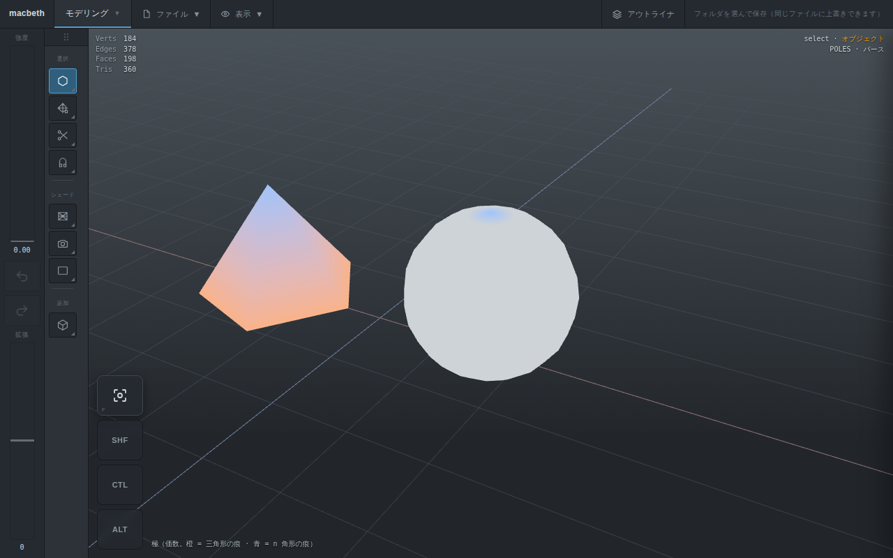

# Opus 作業指示書 #16: スムースが「隣でないもの」を隣として数えている

作成: 2026-09-10。ユーザーの問い（**「ZBrush は三角形が混じるとうまく彫れないが、
このソフトはどうか」**）を調べていて見つけた。

**`34` の T2 より先にやる。** 理由は 0 章の最後。

---

## 0. 何が起きているか

### 見つけたもの

`src/core/sculpt.ts` の `localAverages`（スムースブラシ）と、`34` の T1 で足した
`src/core/mask.ts` の `blurMask`（マスクのぼかし）は、**三角形の 3 辺**を隣として
数えている。

うちは四角を**頂点 0 からの扇**で三角形にしている（`mesh.ts` の `triangulate`）。
四角 `c0-c1-c2-c3` は `(c0,c1,c2)` と `(c0,c2,c3)` になるので、**`c0-c2` という
対角線が辺として出てくる**。これは面の辺ではない。つまり:

> **四角の対角線を「隣」として数えている。**

コードには「同じ隣を何度も足すことになるが、平均なので偏りは出ない」と書いて
あるが、**これは間違い**。足しているのは同じ隣ではなく、隣ではないものである。

### 実測（平面 4×4。頂点ごとに、どの頂点を何回数えているか）

| 頂点 | 本物の辺 | 対角線 |
|---|---|---|
| 内部 2 | 1×2 · 3×2 · 5×2 · 10×2 | **0×2 · 12×2** |
| 内部 5 | 2×2 · 4×2 · 7×2 · 12×2 | **1×2 · 13×2** |
| 境界 1 | 0×1 · 2×2 · 4×1 | **5×2** |
| 境界 0（角） | 1×1 · 3×1 | **2×2** |

読み方:

- **内部**では、本物の隣 4 つに加えて**対角線が 2 つ**、同じ重みで混ざる。
  4 つある四角のうち **2 つぶんだけ**なので、**混ざり方が方向に偏っている**。
  どちらの対角が出るかは、面のコーナーの並び順で決まる。形とは関係がない
- **境界の角**（頂点 0）では、**対角線 1 本が本物の辺 2 本ぶんの重み**を持つ。
  角が対角の方向へ引っ張られる

### 閉じたメッシュでも直っていない（球 8×6 で確認）

| | 重みが不揃いな頂点 | 隣でないものを数えた回数 |
|---|---|---|
| いま | 0 / 42 | **64** |
| 対角を外すと | 0 / 42 | **0** |

閉じたメッシュでは重み自体はそろっている。**そろっていないのは「誰を隣と
呼ぶか」のほう。** スムースの効く範囲が本来の 1 リングより広く、しかも
**四角の割り方しだいでどちらへ広がるかが変わる**。

### なぜ三角形の話につながるか

Catmull-Clark を 1 回かければメッシュは全部四角になる（三角形 1 枚 → 四角 3 枚。
確認済み）。だから**三角形の上を彫ることはない**。残るのは:

1. **極**。三角形の中心だった頂点は価数 3 のまま、何段上げても消えない
2. **密度の食い違い**。三角形は 3 つ、四角は 4 つに割れる

**1 も 2 も Catmull-Clark マルチレゾの性質なので、うちにも同じようにある。**
そこは直せない。

直せるのは「荒れた所をスムースで均す」ほうである。**極のまわりや境界は、
まさに対角線の混ざり方が読めなくなる場所。** そこでスムースが偏っていると、
均そうとするほど変な方向へ寄っていく。**三角形混じりで「うまくいかない」
感じを、うちが自分で足している。**

### `34` の T2 より先にやる理由

- `34` の T3 で **Shift の一時スムース**を入れる。偏ったスムースの上に UI を
  乗せてから直すと、ユーザーが「Shift の効きが変わった」と二度評価することになる
- `34` の T1 で入れた `blurMask` にも**同じ間違いが入っている**。マスクの
  ぼかしは境目をなじませるためのものなので、偏っていると用を成さない
- 直し自体は小さく、`34` の T2 以降（データと保存、UI）と当たらない

---

## 1. 順番と理由

| 順 | タスク | 理由 |
|---|---|---|
| T1 | **本物の辺だけを数える**（`triangulate` が印を出し、スムースとぼかしがそれを見る） | これが直し。速さは変わらない（割り算も表引きも増えない） |
| T2 | **極を見せる**（価数の表示） | 「どこが荒れるか」を彫る前に見せる。ZBrush は教えてくれない |
| T3 | **門**（テスト、通し確認、重さが変わっていないこと） | |

**T3 が終わったら報告して止まる。** そのあと `34` の T2 へ戻る。

---

## T1. 本物の辺だけを数える

### 印は計算せずに分かる

`triangulate()` は n 角形を `i = 1 … n-2` で回し、`(c0, c_i, c_{i+1})` を出す。
この 3 辺のうち面の辺なのは:

| 三角形の辺 | 本物か |
|---|---|
| `(v0, v1)` = `(c0, c_i)` | **`i === 1` のときだけ** |
| `(v1, v2)` = `(c_i, c_{i+1})` | **いつでも** |
| `(v2, v0)` = `(c_{i+1}, c0)` | **`i === n-2` のときだけ** |

三角形（`n === 3`）は `i = 1` の 1 回だけなので、3 辺とも本物になる。正しい。

**隣接表も辺の一覧も要らない。** ループの中の `i` と `n` だけで決まる。

### 直す場所

**1. `src/core/mesh.ts` の `triangulate()`**

返り値に 1 本足す。**三角形 1 つにつき 1 バイト。**

```ts
/** 三角形にしたもの。`Mesh.triangulate()` が返す。 */
export interface Triangulation {
  tri: Uint32Array;
  triToFace: Uint32Array;
  /**
   * 三角形ごとに、3 辺のうちどれが**面の本物の辺**か（下位 3 ビット）。
   * bit0 = (v0,v1) / bit1 = (v1,v2) / bit2 = (v2,v0)。
   *
   * 四角以上を扇で割ると対角線が出る。対角線は面の辺ではないので、
   * 「隣」を数えるものは必ずこれを見ること（`35` の 0 章）。
   */
  realEdges: Uint8Array;
}
```

`realEdges[t] = (i === 1 ? 1 : 0) | 2 | (i === n - 2 ? 4 : 0)`。

**2. `src/core/sculpt.ts` の `localAverages`**

`add(a,b)` の 6 回を、印の立っている辺だけにする。

```ts
if (r & 1) { add(a, b); add(b, a); }
if (r & 2) { add(b, c); add(c, b); }
if (r & 4) { add(c, a); add(a, c); }
```

**3. `src/core/mask.ts` の `blurMask`**

同じ直し。

### 型を通して、直し漏れをコンパイラに探させる

**引数を `Uint32Array` のままにしないこと。** 印を渡し忘れても動いてしまい、
その場所だけ古い挙動が残る。次の 4 つは `Triangulation` を受け取るように変える:

- `strokeFootprint(mesh, bvh, tris, point, radius)`
- `applyStroke(mesh, fp, tris, input)`
- `blurMask(tris, values)`
- `localNormals` / `localAverages`（中の関数）

呼ぶ側は `view.tri.tri` ではなく `view.tri` を渡すだけになるので、むしろ短くなる。
`ObjectView.tri` の型も `Triangulation` にする。

`buildBvh(positions, { tri })` は `tri` しか見ないのでそのままでよい。

### テスト（`tests/sculpt.test.ts` と `tests/mask.test.ts` に足す）

1. **印が正しい**: 三角形の面は 3 辺とも本物。四角の面は各三角形で 2 辺だけ本物。
   五角形でも数が合う
2. **隣でないものを数えない**: 球（閉じたメッシュ）で、スムースが数える相手が
   **`mesh.edges()` に必ず入っている**こと。いまは 64 回外れる（0 章の表）
3. **等方になる**: 平面の内部の頂点で、本物の隣 4 つの重みがそろっている
4. **境界の角が対角へ引かれない**: 平面の角の頂点で、数える相手が本物の辺 2 本
   だけになっている
5. **形が変わらないこと**（回帰）: `tests/sculpt.test.ts` の
   「10 回掛けても平面が縮まない」はそのまま通ること
6. **ぼかしも同じ**: `blurMask` が対角を数えない

---

## T2. 極を見せる

三角形を入れた人が困るのは「**どこが荒れるか事前に分からない**」ことなので、
見せる。

### 決め

- `Display` に **`"poles"`** を足す（`wire` / `shaded` / … と同じ並び）。
  ヒートマップ（UV の歪み）と同じ仕組みに乗せる: `heatMaterial()` と
  同じ `vertexColors` の材質で、頂点色を価数から作る
- 価数は **`mesh.vertexFaces()` の数**で数える（`surfaceGeometry` が既に作って
  いるので、新しい隣接表を作らない）
- 色分けは 3 つだけにする。**細かく分けても読めない**

| 価数 | 色 | 意味 |
|---|---|---|
| 4 | 素の灰色 | ふつう |
| 3 | 1 色 | 三角形の痕。ここが引きつれる |
| 5 以上 | もう 1 色 | n 角形の痕・ポール |

- **境界の頂点は数が 1 つ少なく出る**ので、境界は素の灰色にしておく
  （そうしないと平面のふちが全部「異常」に見えて読めなくなる）。
  境界かどうかは、その頂点に触る面の数と辺の数の食い違いで分かる
- 色は**トポロジが変わったときだけ**作り直す。`stampsOf(o).topology` で控える
  （`32` の T5 の仕組みをそのまま使う）

### どこから出すか

表示の長押しメニューに 1 つ足すだけ。**スカルプト専用にしない**（極を直すのは
モデリング側の仕事なので、モデリングで見えないと意味がない）。

---

## T3. 門

### 重さ

**1 打ちの重さが変わっていないこと。** 印を見る `if` が 3 つ増えるだけなので、
変わるはずがない。`33` の末尾と同じやり方で測って、**5.9ms のままである**ことを
確かめる（CI・25 万四角形・1.66 万頂点）。

`triangulate()` は 1 バイト × 三角形数だけ増える。25 万四角形のレベル 2 で
約 0.9MB。`estimateLevelBytes` は 1 面あたり 560 バイト見ているので、
**見積もりを変える必要はない**。

### 通し確認（`scripts/smoke.mjs`）

`33` の項目の隣に 1 つ。**終わったらモードと選択とカメラを必ず戻す**（`33` で
3 回引っかかった）。

- 球に段を 2 つ足してスムースを掛け、**動いた頂点が本物の隣だけから平均を
  取っている**こと。実装の中を覗くのではなく、**同じメッシュを 2 通りの
  コーナー順で作って、結果が一致する**ことで見る（対角を数えていると、
  コーナーの並べ方を変えただけで結果が変わる）
- `"poles"` 表示で、球（全部価数 4）が素の灰色になり、三角形を混ぜたものに
  色が付くこと

PNG: `docs/img/35-poles.png`（三角形を混ぜたものを `"poles"` で表示）。
`scripts/shot.mjs` に足す。

### 実機で見てもらうこと（報告に書く）

1. スムースの効き方が変わっていないか（**均一な球では見た目はほぼ同じはず**。
   変わって見えるなら、それは今まで偏っていた分）
2. 三角形を含む形を読み込んで、`"poles"` でどこが荒れるか見えるか

---

## 決めてあること

- 対角線は隣ではない。**「隣」を数えるものは必ず `realEdges` を見る**
- 印は扇の割り方から決まる。**隣接表も辺の一覧も作らない**
- 引数は `Triangulation` にして、**直し漏れをコンパイラに見つけさせる**
- 極の色分けは 3 つだけ。境界は素の灰色

## やらないこと

- **面積で重みを付けたスムース**（Laplace-Beltrami）。密度が食い違う所でも
  同じ効き方になるので**これが本命**だが、`34` を止めてまでやる大きさではない。
  **S2-4 へ**（`28` に足す）
- **境界の重みの直し**。境界の頂点は、境界側の隣が内側の隣の半分の重みになる
  （面が 1 つしか触っていないため）。閉じたメッシュでは起きないので後回し。
  直すなら「境界の頂点は境界の隣とだけ平均する」（細分割の境界規則と同じ）
- **リトポロジ**（ZRemesher にあたるもの）。三角形の本当の解決策だが、別の話
- 極の自動修正

---

## 実装の報告（Opus、2026-09-10）

T1〜T3 すべて済み。branch `claude/tablet-3d-modeling-app-f6b1x5`。
**core 309 テスト**（302 → 309）。`dist` と `app/` の両方で通る。

### T1: 本物の辺だけを数える

`Mesh.triangulate()` が `Triangulation`（`tri` / `triToFace` / **`realEdges`**）を
返すようにした。印は指示書の規則そのままで、**隣接表も辺の一覧も作らない**。

直したのは 2 か所。`localAverages`（スムース）と `blurMask`（マスクのぼかし）。

**引数を `Triangulation` に変えたのが効いた。** `Uint32Array` のままだと印を
渡し忘れても動いてしまう。型を変えたらコンパイラが 5 ファイル 18 か所を
そのまま出してきたので、直し漏れは無い。

#### 見ていること（テスト 6 つ。どれも印を潰すと落ちる）

| 見るもの | 内容 |
|---|---|
| 印が正しい | 立っている辺は必ず `mesh.edges()` にある。面のどの辺も数え落としがない |
| 面の形ごと | 三角形は 3 辺、四角は三角形ごとに 2 辺、五角形は 2 / **1** / 2 |
| **コーナー順で変わらない** | 同じ形のまま面のコーナーを回して 4 通り作り、スムースを 3 回かけて一致すること。差は最大 `1e-7`（足す順の丸めだけ） |
| 対角を平均に入れない | 中心の**対角の頂点だけ**を持ち上げてスムース。正しければ中心は 0 のまま。対角を数えていたときは 2/6 = 0.33 持ち上がる |
| ぼかしも同じ | コーナー順で変わらない。1 点から広がる先が面の辺の先だけ |
| 形が変わらない | 「10 回掛けても平面が縮まない」がそのまま通る |

「コーナー順で変わらない」は**中を覗かずに済む**のがよい。対角を数えていれば、
同じ形でもコーナーを回しただけで結果が変わるので、そこだけ見ればよい。

なお筆がメッシュ全体を覆う大きさで見ている。範囲のふちでは、どの三角形が
拾われるかが割り方で変わって隣が少し欠ける（`sculpt.ts` の前置きどおり
許している分）。見たいのはその欠けではなく対角のほう。

### T2: 極を見せる

`Display` に `"poles"`。ショートカットは **0**、表示の長押しメニューの SE。

| 価数 | 色 |
|---|---|
| 4、または境界 | 素の灰 |
| 3 以下 | 橙（三角形の痕） |
| 5 以上 | 青（n 角形の痕・ポール） |

価数は `vertexFaces()` の数で数える（陰影付けが既に作っているので、新しい
隣接表を作らない）。境界は面の数が 1 つ少なく出るので素の灰にしてある。
色は**トポロジが変わったときだけ**作り直す。



**UV 球の上下に青が出る。** これは正しい。UV 球は極を持つ（そこだけ価数が
`sdAxis`）。「全部四角なら 1 色」ではないことは、通し確認でも平面（灰だけ）と
分けて見ている。

#### ついでに見つけた取りこぼし

HUD の表示名の表が `Record<string, string>` だったので、`"poles"` を足しても
コンパイラが何も言わず、画面に **`undefined`** と出た。`Record<Display, string>` に
変えた。**表示を足したときに書き忘れる場所は、型で塞いでおくこと。**

### T3: 門

**1 打ちの重さは変わっていない。** CI・25 万四角形・1.66 万頂点、3 回:

| | `33` の末尾 | いま |
|---|---|---|
| 範囲を拾って動かす | 5.9ms | **5.9ms**（6.1 / 5.82 / 5.9） |

`realEdges` は三角形 1 つにつき 1 バイト。25 万四角形のレベル 2 で約 0.9MB。
`estimateLevelBytes`（1 面 560 バイト）はそのままでよい。

通し確認に 2 つ足した。

- スムースが隣でないものを数えない（コーナーを回しても差 `1.2e-7` / 印 360 本
  すべて面の辺）
- 極の表示（平面 [灰] / 球 [灰,青] / 五角錐 [橙,青] / 戻すと素の材質）

### 実機で見てほしいこと

1. **スムースの効き方**。均一な球ではほぼ同じに見えるはず。変わって見えるなら、
   それが今まで偏っていた分
2. **マスクのぼかし**（`34` の T4 が入ってから）
3. 表示の長押し → **極**。手持ちのモデルでどこが荒れるか見えるか

### 次

`34` の T2（`SceneObject.mask`、`.mbz`、段を変えたときの移し替え）へ戻る。
