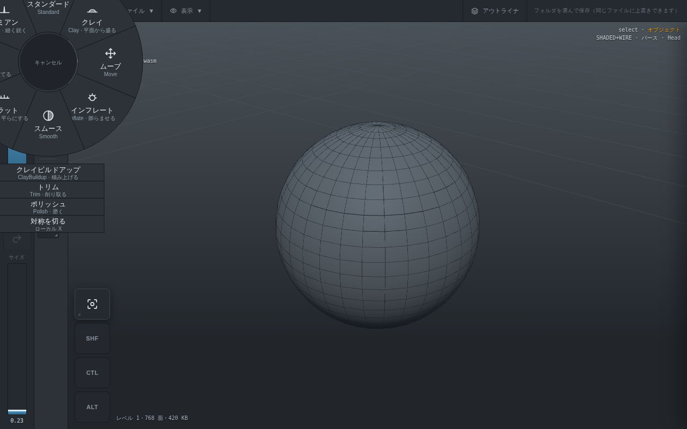

# Opus 作業指示書 #18: S2-4 の前半 — 面積の重みと、残りのブラシ

作成: 2026-09-10。`34` と `36` が終わってから着手。`28` の **S2-4 の前半**。

---

## 0. S2-4 を 2 つに割る

`28` の S2-4 には、あとから足したものが積み上がって 6 つ入っている。

| | 中身 | どちら |
|---|---|---|
| 1 | **面積で重みを付けたスムース**（Laplace-Beltrami） | **`38`** |
| 2 | **残りのブラシ** 8 つ | **`38`** |
| 3 | **筆圧のカーブ UI** | **`38`** |
| 4 | スカルプトレイヤー | `42`（当初 `39` と書いたが、実機の声で `39` = ブラシの直し、`40` = 軽くする、`41` = 対称・ゲージ・輪 を先に挟んだ） |
| 5 | 再投影（ZBrush の Project All） | `42` |
| 6 | ローをハイに合わせる | `42` |

**1〜3 は同じものを触る。** 新しいブラシのうち Clay / Flatten / Trim / Polish は
「まわりの平均の面」を要るので、平均の取り方（1）が先に正しくないと、
そのぶんだけ全部が歪む。筆圧のカーブ（3）もブラシの状態の隣。

**4〜6 はマルチ解像度のデータの話**で、ブラシとは別。`42` に分ける。

---

## 1. 順番と理由

| 順 | タスク | 理由 |
|---|---|---|
| T1 | **面積で重みを付けた平均**（`localAverages` を直す）と、**平面あて** | 新しいブラシ 8 つのうち 4 つがこれを使う。先に正しくする |
| T2 | **ブラシを 8 つ足す**（core） | 形の正しさをテストで固める |
| T3 | **つなぐ**（メニュー、アイコン、言い訳） | 触れるようにする |
| T4 | **筆圧のカーブ** | ブラシが増えてから調整の口を出す |
| T5 | **門**（1 打ちの重さ、通し確認、実機の確認項目） | |

**T5 が終わったら報告して止まる。**

---

## T1. 面積の重みと平面あて

### なぜ面積で重みを付けるか

`35` で「隣は面の本物の辺だけ」に直したが、**まだ数を数えているだけ**。
隣の頂点を等しく足して割っている。三角形と四角の境目のように**密度が
食い違う所では、細かい側へ寄る**。三角形混じりの本命はここ（`35` の
「やらないこと」で S2-4 に送った分）。

### 直し

`localAverages` の重みを、**辺を挟む 2 つの三角形の面積**にする
（cotangent の代わりに面積で近似する。cot は鈍角で負になって暴れるが、
面積なら常に正で、密度には同じだけ効く）。

- いまは `sum[v] += p[u]; count[v]++`
- 直すと `sum[v] += p[u] * w; total[v] += w`。`w` はその辺を含む三角形の面積
- 面積は `localNormals` が作る外積の長さの半分。**同じループで拾える**ので、
  三角形を 2 度なめない

**素の四角格子では結果が変わらない**こと（面積が同じなので）をテストで見る。
変わるのは密度が食い違う所だけ。

### 平面あて（Flatten / Trim / Polish / Clay に要る）

範囲の頂点から**最小二乗の平面**を出す。

- 中心 = 重みつきの重心（重みはブラシの減衰 × 面積）
- 法線 = 共分散行列のいちばん小さい固有ベクトル…**にしない**。
  範囲の**法線の重みつき平均**で足りる（`localNormals` がもう作っている）。
  固有値を解くと 3×3 の対称行列の固有分解が要り、割に合わない
- 返すのは `{ center, normal }` の 1 組

`src/core/sculpt.ts` に `localPlane(mesh, fp, tris, stamp, weights)` を足す。

---

## T2. ブラシを 8 つ足す

`05` の一覧のうち、まだ無いもの。**どれも `applyStroke` の枝を 1 つ足すだけ**で、
範囲の取り方も履歴も描画も変わらない。

| 種類 | 動き | 使うもの |
|---|---|---|
| **Clay** | 平面から**外へ**押し出す。平面より内側の頂点をより強く上げる（土を盛る） | 平面 |
| **ClayBuildup** | Clay と同じだが**平面を無視して**法線方向に一定量。重ねると立ち上がる | 法線 |
| **Inflate** | 法線方向へ。Standard と違い**減衰を掛けたぶんだけ膨らむ**（面を押し広げる） | 法線 |
| **Pinch** | 範囲の中心へ**画面と平行に**寄せる。稜線を立てる | 中心 |
| **Flatten** | 平面へ**寄せる**（両側から） | 平面 |
| **Trim** | 平面より外だけを平面へ落とす（削り取る） | 平面 |
| **Damien Standard** | Standard を細く鋭く。減衰を `t⁴` にして中心だけ効かせる | 法線 |
| **Polish** | Flatten + Smooth。平面へ寄せてから隣の平均へ少し寄せる | 平面 + 平均 |

### 決め

- **`BrushKind` に足すだけ。** `StrokeInput` の形は変えない
- **マスクと裏面マスクは全部に効く**（重みに掛かるので、枝の前で済んでいる）
- **法線を使う枝が増えるので、`localNormals` は 1 回だけ作って使い回す**
  （いまは Standard と裏面マスクで作っている。条件を「使う種類なら」に広げる）
- Inflate と ClayBuildup は Standard と同じ `DAB_DEPTH` を基準にする。
  **強さの手触りを揃える**（実機で決めた 0.67 が全部に効くように）
- Pinch は**動く量を半径に対する割合**で決める。ワールド単位にすると
  大きい像で効かなくなる

### テスト（`tests/sculpt.test.ts` に足す）

種類ごとに 1 つずつ。共通で見るのは 3 つ。

1. **半径の外は 1 ミリも動かない**（全種類）
2. **マスク 1 で動かない**（全種類）
3. **動いた頂点だけ返す**（全種類）

種類ごと:

- Clay / Flatten / Trim: 平らな板に当てると**平らなまま**（平面が板と同じなので）。
  でこぼこに当てると**ばらつきが減る**
- Trim は**平面より内側を動かさない**
- Inflate: 球に当てると**半径が増える**
- Pinch: 範囲の頂点の**広がりが減る**
- Damien: 同じ強さの Standard より**細い**（動いた頂点が少ない）
- Polish: Flatten だけより**ばらつきが減る**

---

## T3. つなぐ

### 筆の長押しメニュー

いまは N / E / W / S の 4 つ（Standard / Move / Smooth / 対称）。
**11 種類は 8 方位に入らない。**

- **8 方位はよく使う 8 つ**: N Standard / NE Clay / E Move / SE Inflate /
  S Smooth / SW Flatten / W Pinch / NW Damien
- **残り 3 つ（ClayBuildup / Trim / Polish）と対称は「一覧」へ**。
  段のメニューが使っている `radialList` の仕組みをそのまま使う
  （`32` の T3。長押しの輪の下に並ぶ）

アイコンは 11 個。**種類が分かる形にする**（全部丸に線では選べない）。

### 言い訳

`strokeHint` はそのまま。ブラシの名前はトーストに出す（今と同じ）。

---

## T4. 筆圧のカーブ

`33` で決め打ちにした所（`brushAt`）に口を出す。

### 決め

- カーブは **1 つの数**で表す。`pow`（0.25〜4、既定 **2**）。
  `効き = pressure ^ pow`。**曲線の編集 UI は作らない**（`05` は「カーブで
  調整可能に」だが、点を打つ UI はタブレットで扱いにくく、数 1 つで足りる）
- **半径と強度で別々**（`05` のとおり）。`pressureSizePow` と
  `pressureStrengthPow`
- 置き場所は**筆のカットイン**（`openToolOptions` の仕組み。ツール列の
  「筆」をタップで開く）。いまブラシのボタンは `onTap: () => {}` で何もしない
  ので、そこに入れる
- 既定は 2。`33` で強度に 2 乗を入れてあるので、**見た目の手触りは変わらない**

### 見ること

`pow` を 1 にすると軽い筆圧でも効き、4 にすると押し込まないと効かない。
`brushAt` の単体テストに 2 つ足す。

---

## T5. 門

### 数字

**1 打ちの重さが 8 割方変わっていないこと。** `33` の末尾と同じやり方
（CI・25 万四角形・1.66 万頂点、3 回の中央値）で、

- **Smooth**: 面積の重みを入れた前後。**1.2 倍以内**
- **新しい 8 つ**: いちばん重いもので、Standard の **1.5 倍以内**
  （Polish は平面と平均の両方を使うので、ここがいちばん重いはず）

### 通し確認

1. 筆の長押しで 8 方位に 8 種類、一覧に残り 3 つと対称が出る
2. 種類を選ぶとアイコンとトーストが変わり、彫ると形が変わる
3. **Flatten を平らな板に当てても平らなまま**（平面あてが効いている）
4. 筆圧のカーブを 1 と 4 にすると、同じ筆圧で動く量が変わる
5. マスクが全種類に効く（濃い所は動かない）

### 実機で見てもらうこと

1. 8 種類を一通り。**Clay と Flatten が ZBrush と同じ手触りか**
2. 一覧に落とした 3 つが選びにくくないか（8 方位の割り当てを変えるべきか）
3. 筆圧のカーブ 1 / 2 / 4 のどれが好みか

---

## 決めてあること

- 平均は**面積の重み**。cotangent は使わない（鈍角で負になる）
- 平面の法線は**範囲の法線の平均**。固有分解はしない
- `BrushKind` を足すだけ。`StrokeInput` の形は変えない
- 筆圧のカーブは**数 1 つ**（`pow`）。曲線の編集 UI は作らない
- 8 方位はよく使う 8 つ。残りは一覧へ

## やらないこと（`39` 以降）

- スカルプトレイヤー、再投影、ローをハイに合わせる（**`39`**）
- アルファ（スタンプ画像）、ストロークタイプ、傾き / 方位（v2）
- 減衰カーブの編集（`pow` で足りるか実機で見てから）
- ポリグループ、キャビティマスク

---

## 実装の報告（Opus、2026-09-10）

T1〜T5 すべて済み。**core 333 テスト**（319 → 333）。`dist` と `app/` の両方で緑。

### T1: 面積の重み

**三角形ごとの面積では駄目だった。** 四角をどちらの対角で割ったかで重みが変わり、
`35` で立てた「コーナーの並び順で結果が変わらない」が壊れる（通し確認が落ちて
気づいた。差 8.4e-3）。**面の面積**（`triToFace` で足し合わせる）に替えて 1.6e-5 まで
落ちた。

残る 1.6e-5 は**平らでない四角に一意な面積が無い**ぶん。座標が 1 前後なので
0.002%。単体テストと通し確認の許容を 1e-4 にした。**対角を数える昔の挙動は
この幅でも 6 つとも捕まる**ことを確かめてある。

平面あては**法線の重みつき平均**。共分散行列の固有分解はしない（範囲は筆の
大きさなのでもともと平らに近く、割に合わない）。

### T2: ブラシ 8 つ

`BrushKind` に足すだけで、範囲の取り方も履歴も描画も変えていない。
マスクと裏面マスクは重みに掛かるので、枝の前で済んでいる。

引っかかったのは 2 つ。

1. **ピンチが「動いていない頂点」を返していた。** ちょうど中心に居る頂点は
   変位が 0 なのに `moved` に入れていた。履歴の差分が無駄に太る
2. **ポリッシュがフラットよりでこぼこになった。** 「平面へ寄せてから平均へ」の
   順だと、平均は**平らにする前**の位置から取ってあるので、平均へ寄せた分が
   平らにした分を打ち消す。**先に平均、あとで平面**に入れ替えた

テストのほうも 1 度直した。フラットを**筆の半径いっぱい**で測っていて、
ふちは減衰 0 で動かないので「中は平ら・ふちはでこぼこ」の形になり、
ばらつきがかえって増えていた。**筆の中ほど**で測る。

### T3: メニュー

11 種類は 8 方位に入らないので、**よく使う 8 つを方位に、残り 3 つと対称を
一覧へ**（段のメニューと同じ `radialList`）。

履歴のラベルの表を `Record<BrushKind, string>` にした。種類を足したときの
書き忘れをコンパイラに拾わせる（`35` の HUD で `undefined` が出た教訓）。

### T4: 筆圧のカーブ

`効き = 筆圧 ^ pow`。**曲線の編集 UI は作らない。** 既定は半径 1 / 強度 2 で、
`33` の手触りのまま。筆のボタンのカットインに置いて、`localStorage` に残す。

### T5: 門

**どちらも通った。**

| | 前 | 後 | 門 |
|---|---|---|---|
| スムース（面積の重み） | 8.41ms | **8.00ms** | 1.2 倍以内 ✓ |
| 新しい 8 つでいちばん重いもの（ダミアン） | — | **6.80ms** | スタンダード 5.80ms の 1.5 倍以内 ✓（1.17 倍） |

CI・25 万四角形・1.66 万頂点、3 回の中央値。面積の重みは 2 周目を足すが、
**重いのは別の所**なので測っても増えない。

| ブラシ | ms |
|---|---|
| スタンダード | 5.80 |
| クレイ | 5.88 / クレイビルドアップ 6.26 / インフレート 6.12 |
| ピンチ 5.82 / フラット 6.06 / トリム 6.06 | |
| ダミアン 6.80 / ポリッシュ 5.86 / スムース 8.00 | |

通し確認 1 項目。8 方位と一覧の中身、10 種類ぜんぶ彫れて履歴が `sculpt`、
**マスク 1 でどの種類も 1 ミリも動かない**、カーブ 1 で 0.360 → 4 で 0.023、
筆のカットインに筆圧の欄が出る。

### 実機で見てほしいこと

1. 8 種類を一通り。**クレイとフラットが ZBrush と同じ手触りか**
2. 一覧に落とした 3 つ（クレイビルドアップ / トリム / ポリッシュ）が
   選びにくくないか。8 方位の割り当てを変えるべきか
3. 筆圧のカーブ 1 / 2 / 4 のどれが好みか（筆のボタンをタップで出る）

### 次

**`39`**: スカルプトレイヤー、再投影、ローをハイに合わせる。
